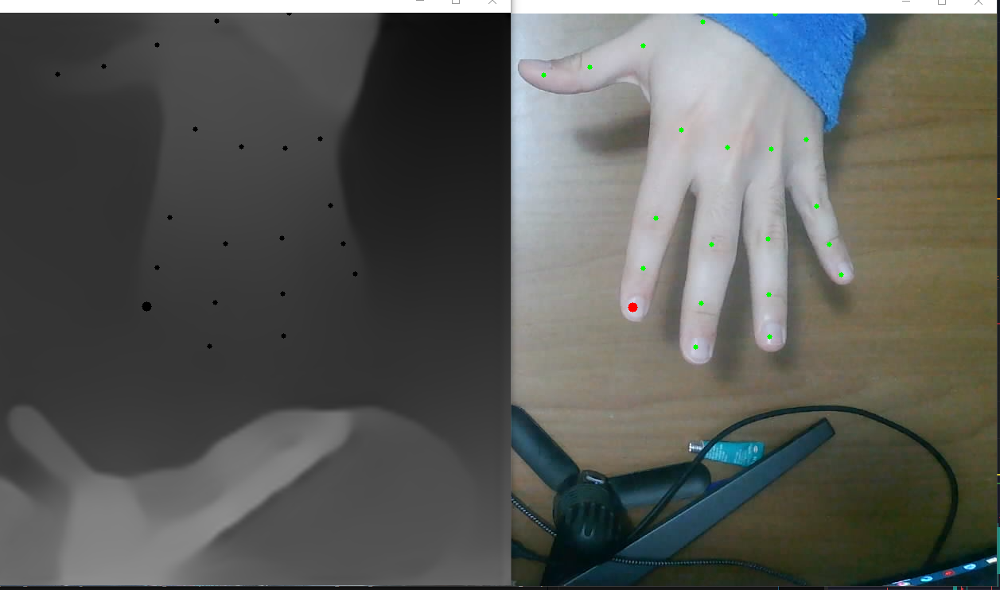
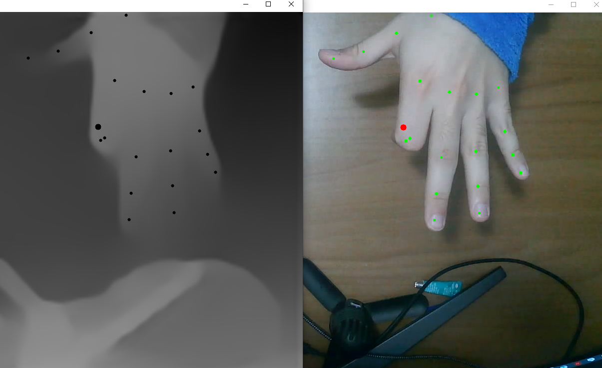
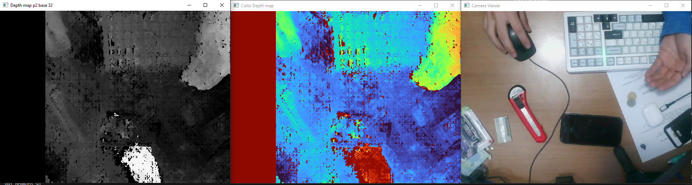

# SANDY - Smart Adaptive and Navigable Desk YEAH!

## L'idea

Il progetto nasce dalla mia necessità di farmi un top per la scrivania personalizzato. Mentre cercavo idee su internet mi imbatto in questo video: [https://youtu.be/U_wsZq89RlM?si=8_blLj5m1tyASBZ0](https://youtu.be/U_wsZq89RlM?si=8_blLj5m1tyASBZ0)

E mi dico: "Figa l'idea ma poco funzionale alla fine". Ed infatti a fine video anche lui dice la stessa cosa: figo come proof of concept, ma poco pratico. **Se solo fosse interattivo... SE SOLO FOSSE INTERATTIVO!**

Ed ecco che mi ritrovo a pensare a come renderla interattiva. La prima cosa che penso è: uso un touch gigante. Ma subito mi vengono in mente i diversi problemi: come faccio a creare un touch per un pezzo di legno/stoffa? E pure se ci riuscissi, come impedisco agli oggetti posati sopra di interagirci?

Allora passo a valutare altre tecnologie, ed ecco che viene in mio soccorso il ML (Machine Learning). Perché non usare qualche modello per tracciare la mano, capire le intenzioni ed i movimenti dell'utente? Ed eccomi qua a mettere in pratica questa idea.

## Libreria ML

**MediaPipe**: libreria open-source di Google usata per creare applicazioni che sfruttano la visione artificiale ed il machine learning in tempo reale, tra cui l'identificazione di mani.

## Hardware

1. **Fotocamera almeno in 720p**  
   _Nota_: Io sto usando per test il PS3 Eye ma ne ho comprata una in 1080p a 20€

2. **Proiettore economico a 720p o meglio a 1080p**  
   **NUOVO**: Su Amazon se ne trovano anche tra i 50€ ed i 150€, ma da quello che ho capito sono un po' problematici (mentono sulla risoluzione), però a noi serve solo con un buon contrasto, una risoluzione decente e che non esplodano dopo 2 giorni di utilizzo, se possibile anche silenziosi.  
   **USATO**: soluzione più accettabile con meno compromessi.

3. **PC**: da capire se usare un PC esterno o il nostro, e nel caso della prima soluzione come far interagire il nostro con il secondo.

## Obiettivi

Questa sezione verrà aggiornata passo passo ma per ora:

1. Creare una struttura del progetto
2. Tracciare le mani  
3. Capire quando clicco o meno sulla scrivania
4. Calibrare il piano
   **Sono Qua**
5. Oscurare la mano (questo punto serve per far sì che quando la mano sta nella zona proiettata non gli vengano proiettate sopra le cose)
6. Interazioni semplici su pulsanti  
   **------ Fine Base -------**
7. Creare una GUI seria con un framework come PyQt5
8. Far allineare la cam alla proiezione e ricreare un piano virtuale
9. Vedere come la mano vista dalla cam si muove nel piano virtuale
10. Far interagire mano e GUI

## Primi passi

Questo è un video che fa vedere lo stato attuale del progetto (attualmente 3.5), lo uso più come proof of concept.

## Aggiornamenti
### 27/12/2025
Sto passando da un sistema che calibra la soglia del touch, con 4 punti, ovvero che trova il piano passando per tre punti A B C, ed il piano passante per 3 punti A D C , ad un sistema  che usa il Plane Fitting Least Squares su 5 punti angoli + centro
⚠️ nuovo problema: l'asse Z non é assoluto ma relativo al polso, bisogna trovare una soluzione per calcolare la profonditá
### 30-31/12/25
avevo 3 opzioni per risolvere il problema dell'asse Z
1) Magie con la posizione delle dita relativa a quella del polso
2) Uso il parallasse, ma necessito di una seconda videocamera, fissata ed ad una distanza fissa dall'altra
3) Uso una IA (Midas) per provare a calcolare una certa profonditá 
 
Ho optato per la 3 ma ora, dopo giorni di tentativi, mi accorco che con Midas ligth (quello completo era troppo pesante e lento) ha il difetto inglobare la posizione della falange con la posizione "media" del resto del dito, fino alla nocca, il che mi ha fatto smadonnare tanto, ma tanto fino a che non me ne sono accorto, ora ho deciso di provare con il parallasse

### 5/01/26
Finalmente ho una depth map decente, sto usando il parallasse con due fotocamere identiche allineate (40€ totale), vedo dei risultati accettabili penso, devo sistemare un po la calibrazione ed il settaggio é "forzato" o meglio il settaggio della funzione di Disparitá é ad hoc per la mia situazione, punto a farne una versione automatizzata in futuro e poi regolabile manualemtne. Ora devo provare a capire bene la profonditá e testare se funziona il riconoscimento del tocco e la calibrazione del piano, in fine cercheró di fare la calibrazione della neo "Stereo Camera" non piú con foto ma con un video .

qui si vedono parecchi dettagli, anche il taglierino vede bene la confomrazione dei solchi, anche le monete si vedono bene esi distinguono le dita nelal amno chiusa.